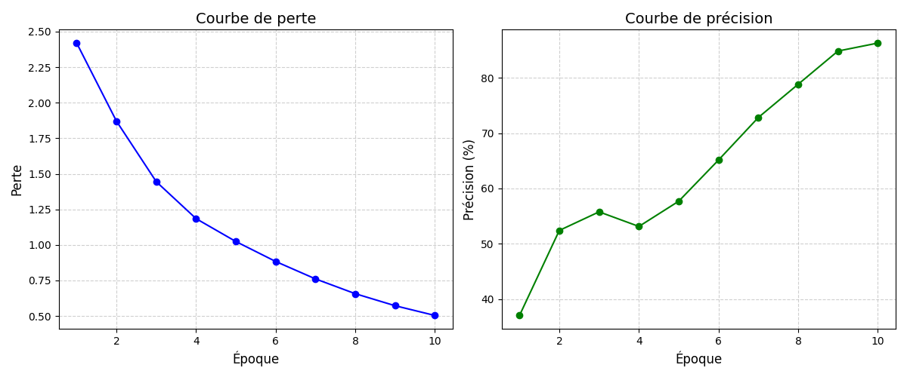
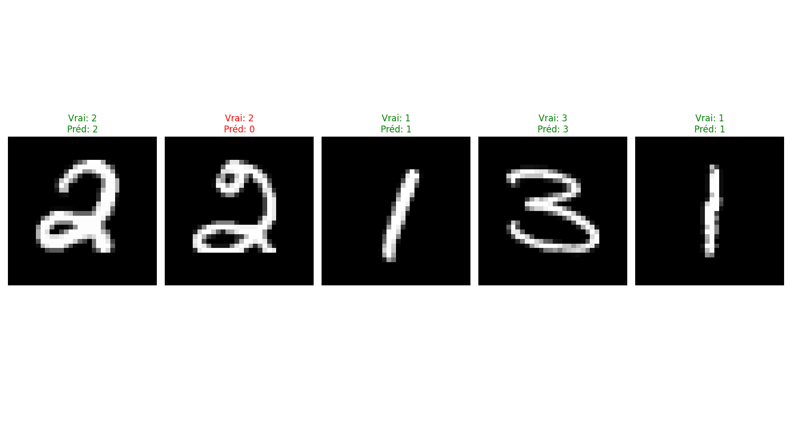

# LeNet-5 en NumPy

Ce projet est une implémentation du réseau de neurones convolutif classique LeNet-5 en utilisant uniquement NumPy. Il est conçu pour fonctionner sur des machines avec des ressources limitées comme un MacBook Pro m1. 

## Architecture

L'architecture LeNet-5 implémentée dans ce projet comprend:

- Couche convolutive (6 filtres, noyau 5x5)
- Pooling moyen 2x2
- Activation ReLU
- Couche convolutive (16 filtres, noyau 5x5)
- Pooling moyen 2x2
- Activation ReLU
- Couche convolutive (120 filtres, noyau 5x5)
- Couche entièrement connectée (84 neurones)
- Activation ReLU
- Couche de sortie (4 classes)

## Prérequis

```
numpy
matplotlib
torchvision (uniquement pour le chargement des données)
```

## Structure du Projet

```
.
├── data/                 # Dossier pour les données MNIST
├── models/               # Définitions des couches et du modèle
│   ├── cnn.py            # Implémentation du LeNet-5
│   └── layers.py         # Implémentation des couches (Conv, FC, etc.)
├── utils/                # Utilitaires
│   ├── dataloader.py     # Chargeur de données MNIST
│   └── metrics.py        # Métriques et fonctions de perte
├── saved_models/         # Modèles entraînés sauvegardés
├── train.py              # Script d'entraînement
├── test.py               # Script de test
└── evaluate.py           # Fonctions d'évaluation
```

## Caractéristiques

- Implémentation à partir de zéro en NumPy
- Optimisé pour fonctionner sur des machines avec ressources limitées
- Classification des chiffres 0, 1, 2 et 3 de MNIST
- Visualisation des courbes d'apprentissage et des exemples de prédiction

## Utilisation

### Entraînement

Pour entraîner le modèle:

```bash
python3 train.py
```

Cela entraînera le modèle avec les paramètres par défaut et sauvegardera:
- Le meilleur modèle (selon la précision) dans `saved_models/lenet5_best.npz`
- Le modèle final dans `saved_models/lenet5_final.npz`
- Une visualisation des courbes d'apprentissage dans `training_curves.png`

### Courbes d'entraînement

Après l'entraînement, les courbes suivantes sont générées:



*Ces courbes montrent l'évolution de la perte et de la précision au cours de l'entraînement.*

### Test

Pour tester un modèle entraîné:

```bash
python3 test.py --model saved_models/lenet5_best.npz --samples 1000
```

Cela évaluera le modèle sur l'ensemble de test et affichera:
- La précision globale
- La précision par classe
- Des exemples de prédictions avec visualisation

### Exemples de prédictions



*Ces exemples montrent des prédictions du modèle sur des images de test. Les prédictions correctes sont en vert, les incorrectes en rouge.*

## Performances

Sur un MacBook Pro avec puce M1, le modèle atteint généralement:
- Une précision d'environ 95-99% sur les chiffres 0, 1, 2 et 3
- Un temps d'entraînement inférieur à 5 minutes pour 5 époques

## Limitations actuelles

- Utilise uniquement les chiffres 0, 1, 2 et 3 de MNIST pour limiter les ressources nécessaires
- N'implémente pas toutes les techniques d'optimisation modernes

## Améliorations possibles

- Ajouter la normalisation par lots (batch normalization)
- Implémenter plus de fonctions d'activation
- Ajouter la régularisation pour éviter le surapprentissage
- Optimiser davantage le code pour de meilleures performances

## Licence

Ce projet est fourni sans licence spécifique pour une utilisation éducative.
